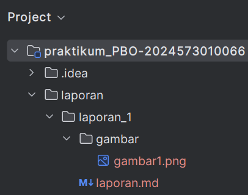
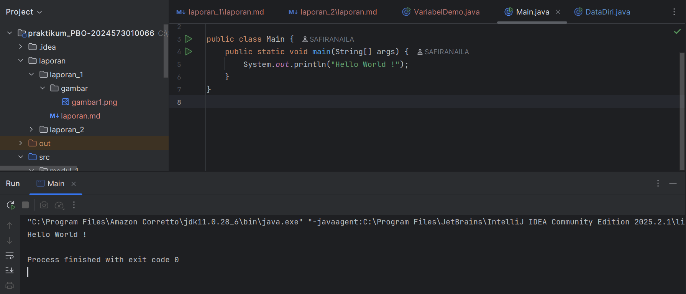

# Laporan Modul 1: Perkenalan Java dan Ekosistemnya
**Mata Kuliah:** Praktikum Pemrograman Berorientasi Objek   
**Nama:** [Safira Naila]  
**NIM:** [2024573010066]  
**Kelas:** [TI 2A]

---

## Abstrak
Laporan ini membahas pengenalan dasar tentang pemrograman berorientasi objek (OOP) dan alasan penggunaan bahasa Java. Dijelaskan juga kelebihan Java, komponen penting yang diperlukan seperti JDK, JRE, dan IDE, serta gambaran umum tentang persiapan praktikum. Selain itu, laporan menyinggung troubleshooting umum yang mungkin terjadi dan pedoman penulisan laporan praktikum.

1. Mendokumentasikan hasil pembelajaran awal tentang OOP dan Java.
2. Menunjukkan pemahaman teori serta ekosistem Java.
3. Membuktikan kesiapan menggunakan tools yang diperlukan.
4. Menjadi bukti keberhasilan menjalankan program sederhana.
5. Melatih penyusunan laporan dengan format ilmiah dan terstruktur.

---

## 1. Pendahuluan
- Java dipilih sebagai bahasa pemrograman karena memiliki banyak keunggulan. Salah satunya adalah platform independence dengan konsep “write once, run anywhere” yang memungkinkan program dijalankan di berbagai sistem operasi tanpa perubahan kode. Selain itu, Java merupakan strongly typed language dengan sistem pemeriksaan tipe yang ketat sehingga meminimalkan error saat runtime. Java juga dilengkapi rich library yang menyediakan berbagai pustaka siap pakai, mulai dari manipulasi string, networking, hingga koneksi database. Dukungan dari komunitas besar memudahkan pembelajaran dan pemecahan masalah, sementara statusnya sebagai industry standard menjadikan penguasaan Java sangat penting dalam dunia kerja.

Untuk mendukung pengembangan, diperlukan beberapa tools utama dalam ekosistem Java, yaitu:

JDK (Java Development Kit) → paket lengkap berisi compiler, library, dokumentasi, dan debugging utilities untuk menulis serta mengompilasi kode Java.

JRE (Java Runtime Environment) → lingkungan runtime berisi JVM dan core libraries, digunakan untuk menjalankan aplikasi Java yang sudah dikompilasi.

JVM (Java Virtual Machine) → inti dari platform Java yang mengeksekusi bytecode, mengelola memori dengan garbage collector, serta melakukan optimisasi performa melalui JIT compiler.

IDE (Integrated Development Environment) → software seperti IntelliJ IDEA yang menyediakan editor, debugger, manajemen proyek, dan fitur otomatisasi untuk mempermudah pengembangan aplikasi Java.

---

## 2. Proses instalasi Java
- Praktikum 1: Instalasi JDK 21 (Amazon Corretto)

Langkah 1: Akses Website Amazon Corretto
1. Buka browser web (Chrome, Firefox, atau Edge)
2. Navigasikan ke alamat: https://aws.amazon.com/corretto/
3. Klik tombol "Download Amazon Corretto" yang terletak di bagian tengah halaman
4. Anda akan diarahkan ke halaman download yang menampilkan berbagai versi yang tersedia

Langkah 2: Pilih Versi Amazon Corretto

1. Pada halaman download, pilih **Amazon Corretto 17** atau **Amazon Corretto 21** (keduanya adalah Long Term Support version).
2. Untuk pembelajaran pemula, **Corretto 17 sangat direkomendasikan** karena stabilitas dan compatibility yang baik.
3. Pastikan Anda memilih versi yang sesuai dengan arsitektur sistem operasi:
    - Windows x64 → Untuk Windows 64-bit (paling umum)
    - Windows x86 → Untuk Windows 32-bit (jarang digunakan)
    - macOS x64 → Untuk Mac dengan processor Intel
    - macOS aarch64 → Untuk Mac dengan Apple Silicon (M1/M2)
    - Linux x64 → Untuk distribusi Linux 64-bit

Langkah 3: Download Installer

1. Klik pada link download yang sesuai dengan sistem operasi Anda.
2. Pilih format installer:
    - Windows → File dengan ekstensi **.msi** (Microsoft Installer)
    - macOS → File dengan ekstensi **.pkg** (Package Installer)
    - Linux → File dengan ekstensi **.deb** (untuk Ubuntu/Debian) atau **.rpm** (untuk RedHat/CentOS)
3. Tunggu proses download selesai (ukuran file sekitar 200-300 MB).
4. Pastikan lokasi download mudah diakses (biasanya folder **Downloads**).

Langkah 4: Instalasi di Windows

1. Buka **File Explorer** dan navigasikan ke folder **Downloads**.
2. Double-click file installer Amazon Corretto (contoh: `amazon-corretto-17-x64-windows-jdk.msi`).
3. Jika muncul dialog **User Account Control**, klik **Yes** untuk memberikan permission.
4. Pada welcome screen installer, klik **Next**.
5. Baca dan setujui **License Agreement** dengan mencentang *"I accept the terms in the License Agreement"*, kemudian klik **Next**.
6. Pada halaman **Custom Setup**, biarkan semua komponen tercentang (default installation), klik **Next**.
7. Catat dengan teliti **installation path** yang ditampilkan (biasanya: `C:\Program Files\Amazon Corretto\jdk17.x.x_xx\`).
8. Klik **Install** untuk memulai proses instalasi.
9. Tunggu proses instalasi selesai (biasanya 2–5 menit).
10. Klik **Finish** untuk menyelesaikan instalasi.

- Praktikum 2: Instalasi Intellj Idea CE

Langkah 1: Mengakses Website JetBrains

1. Buka browser web dan navigasikan ke: https://www.jetbrains.com/idea/
2. Pada halaman utama, Anda akan melihat dua pilihan: **Ultimate** (berbayar) dan **Community** (gratis).
3. Klik tombol **"Download"** di bawah *Community Edition*.
4. Anda akan diarahkan ke halaman download yang otomatis mendeteksi sistem operasi Anda.

Langkah 2: Download IntelliJ IDEA

1. Pastikan tab **"Community"** dipilih (bukan *Ultimate*).
2. Sistem akan otomatis mendeteksi OS Anda dan menampilkan **download button** yang sesuai.
3. Klik **"Download"** untuk memulai download.
4. Ukuran file sekitar **700MB–1GB**, pastikan koneksi internet stabil.
5. File installer akan tersimpan di folder **Downloads** dengan nama seperti:
    - Windows → `ideaIC-2023.x.x.exe`
    - macOS → `ideaIC-2023.x.x.dmg`
    - Linux → `ideaIC-2023.x.x.tar.gz`


Langkah 3: Instalasi di Windows

1. Navigasikan ke folder **Downloads** dan double-click file `ideaIC-2023.x.x.exe`.
2. Jika Windows menampilkan **security warning**, klik **"Yes"** atau **"Run anyway"**.
3. Pada welcome screen, klik **Next**.
4. Pilih **installation directory** (default: `C:\Program Files\JetBrains\IntelliJ IDEA Community Edition 2023.x.x`).
5. Klik **Next** untuk melanjutkan.
6. Pada **Installation Options**, centang opsi berikut:
    - *"64-bit launcher"* (untuk sistem 64-bit)
    - *"Add launchers dir to the PATH"*
    - *"Add 'Open Folder as Project'"*
    - *.java – Associate .java files*
    - *"Download and install JetBrains Runtime"*
7. Klik **Next**.
8. Pada **Start Menu Folder**, biarkan default dan klik **Install**.
9. Tunggu proses instalasi selesai (**5–10 menit**).
10. Centang **"Run IntelliJ IDEA Community Edition"** dan klik **Finish**.

Langkah 4: First Time Setup IntelliJ IDEA

1. Saat pertama kali membuka **IntelliJ IDEA**, Anda akan melihat *"Welcome to IntelliJ IDEA"*.
2. Pada dialog *"Import IntelliJ IDEA Settings"*, pilih **"Do not import settings"**.
3. Klik **OK**.
4. Pilih **UI Theme**:
    - Light → Tema terang (cocok untuk lingkungan terang).
    - Darcula → Tema gelap (cocok untuk mata yang sensitif).
5. Klik **Next**.
6. Pada *"Default plugins"*, biarkan semua plugin default tercentang.
7. Klik **Next**.
8. Pada *"Featured plugins"*, Anda bisa skip dulu dengan klik **"Start using IntelliJ IDEA"**.


Langkah 5: Verifikasi Konfigurasi JDK di IntelliJ IDEA

1. Pada **Welcome screen IntelliJ IDEA**, klik **"New Project"**.
2. Di panel kiri, pilih **"Java"**.
3. Pastikan **Project SDK** menampilkan Amazon Corretto yang telah diinstal.
4. Jika belum muncul, klik **Add SDK → JDK**.
5. Navigate ke folder instalasi Amazon Corretto:
    - Windows → `C:\Program Files\Amazon Corretto\jdk17.0.x_xx`
    - macOS → `/Library/Java/JavaVirtualMachines/amazon-corretto-17.jdk/Contents/Home`
    - Linux → `/usr/lib/jvm/java-17-amazon-corretto`
6. Klik **OK** untuk menambahkan JDK.
7. Klik **Cancel** untuk keluar dari dialog *New Project*.


---

## 3. Laporan proses pembuatan program hello world dengan java
- Praktikum 3: Persiapan Repository Projek

1. Masuk ke akun github yang telah dibuat: https://github.com/topics/login
2. Buatkan sebuah repository baru dengan nama praktikum_PBO-2024573010066

- Praktikum 4: Hello World Java

1. Buat sebuah project baru di intellj dengan memilih file -> new -> project
2. Buatkan file dan folder pada new project, untuk uji coba program dan buat laporan, seperti berikut:
   
3. Buat sebuah java class baru dan beri nama Main dengan klik kanan pada folder src pilih new -> Java Class
4. Tuliskan kode seperti berikut:

````
   public class Main {
       public static void main(String[] args) {
           System.out.println("Hello World");
       }
   }
````
`5.`Jalankan program dan berikut hasilnya:

`6.` Kemudian push program tersebut ke github

---

## 4. Referensi
Module 1 - Course Introduction & Lab Setup-https://hackmd.io/@mohdrzu/ByrYifVFeg
w3school-https://www.w3schools.com/java/java_oop.asp


---
