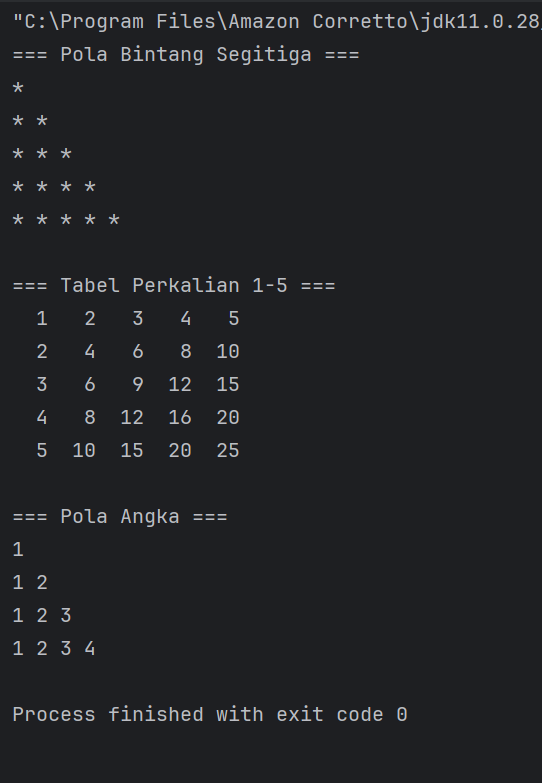

# Laporan Modul 2: Dasar Pemrograman Java
**Mata Kuliah:** Praktikum Pemrograman Berorientasi Objek   
**Nama:** [Safira Naila]  
**NIM:** [2024573010066]  
**Kelas:** [TI 2A]

---

## 1. Abstrak
Laporan praktikum ini membahas penerapan struktur kontrol dalam pemrograman, meliputi percabangan dan perulangan. Melalui beberapa studi kasus program, praktikan mempelajari cara mengatur alur logika program secara sistematis. Hasil praktikum menunjukkan bahwa pemahaman terhadap struktur kontrol sangat penting untuk membangun program yang terarah, efisien, dan mudah dikembangkan.

---
## 2. Praktikum
### Praktikum 1 - Variabel dan Tipe Data
#### Dasar Teori
Variabel adalah wadah untuk menyimpan data yang memiliki tipe tertentu. Dalam Java, setiap variabel harus dideklarasikan dengan tipe data sebelum digunakan. Hal ini karena Java bersifat strongly typed language, sehingga tipe data variabel tidak bisa berubah-ubah setelah didefinisikan.

Di Java, ada beberapa jenis variabel, misalnya:

String - menyimpan teks, seperti "Halo". Nilai string diapit tanda kutip ganda  
int - menyimpan bilangan bulat (bilangan bulat), tanpa desimal, seperti 123 atau -123  
float - menyimpan angka floating point, dengan desimal, seperti 19,99 atau -19,99  
char - menyimpan karakter tunggal, seperti 'a' atau 'B'. Nilai char diapit oleh tanda kutip tunggal  
boolean - menyimpan nilai dengan dua status: benar atau salah

Tipe data dibagi menjadi dua kelompok:
1. Tipe Data Primitif
   Tipe data primitif menentukan tipe variabel dan jenis nilai yang dapat ditampungnya.

   `byte` → Menyimpan bilangan bulat dari -128 sampai 127  
   `short` → Menyimpan bilangan bulat dari -32.768 sampai 32.767  
   `int` → Menyimpan bilangan bulat dari -2.147.483.648 sampai 2.147.483.647  
   `long` → Menyimpan bilangan bulat dari -9.223.372.036.854.775.808 sampai 9.223.372.036.854.775.807  
   `float` → Menyimpan bilangan pecahan, cukup untuk 6–7 digit desimal  
   `double` → Menyimpan bilangan pecahan, cukup untuk 15–16 digit desimal  
   `boolean` → Menyimpan nilai logika true atau false  
   `char` → Menyimpan satu karakter atau huruf tunggal, juga dapat menyimpan nilai ASCII
2. Tipe Data Referensi
   Tipe ini berupa objek yang menunjuk ke alamat memori, contohnya: `String`, `Array`, dan `Class`.

#### Langkah Praktikum
1. Buat package `modul_2` di dalam `src`
2. Buat file baru dengan nama VariabelDemo.java di folder modul 2
3. Masukkan kode berikut:
```declarative
public class VariabelDemo {
    public static void main(String[] args) {
        // Deklarasi dan inisialisasi variabel
        int umur = 20;
        double tinggi = 175.5;
        char grade = 'A';
        boolean lulus = true;
        String nama = "John Doe";

        // Menampilkan nilai variabel
        System.out.println("Nama: " + nama);
        System.out.println("Umur: " + umur + " tahun");
        System.out.println("Tinggi: " + tinggi + " cm");
        System.out.println("Grade: " + grade);
        System.out.println("lulus: " + lulus);

        int a = 10;
        int b = 3;

        System.out.println("\n=== Operasi Aritmatika ===");
        System.out.println("a = " + a);
        System.out.println("b = " + b);
        System.out.println("a + b = " + (a + b));
        System.out.println("a - b = " + (a - b));
        System.out.println("a * b = " + (a * b));
        System.out.println("a / b = " + (a / b));
        System.out.println("a % b = " + (a + b));

        System.out.println("\n=== Casting Tipe Data ===");
        double nilaiDouble = 9.8;
        int nilaiInt = (int) nilaiDouble;

        System.out.println("Nilai double:" + nilaiDouble);
        System.out.println("Setelah casting ke int:" + nilaiInt);

        // Automatic promation
        byte byteVar = 50;
        short shortVar = 100;
        int hasil = byteVar + shortVar;
        System.out.println("byte + short =" + hasil + " (tipe: int)");


    }
}

```
#### Screenshoot Hasil


#### Analisa dan Pembahasan
Pada praktikum ini, percobaan mendeklarasikan variabel dengan berbagai tipe data berhasil menunjukkan perbedaan karakteristik masing-masing tipe. Variabel numerik seperti `int`, `float`, dan `double` digunakan untuk operasi aritmatika dengan tingkat presisi berbeda, sedangkan `char` menyimpan karakter tunggal dan `boolean` hanya bernilai `true` atau `false`. Dari hasil eksekusi program terlihat bahwa setiap variabel harus dideklarasikan terlebih dahulu dengan tipe data tertentu, sesuai dengan sifat Java yang strongly typed. 

### Praktikum 2 - Input, Output dan Scanner
#### Dasar Teori
Input dan output adalah proses penting dalam pemrograman untuk berinteraksi dengan pengguna. Output digunakan untuk menampilkan informasi ke layar dengan perintah System.out.print(), System.out.println(), dan System.out.printf(). Input digunakan untuk menerima data dari pengguna menggunakan class Scanner dari java.util. Scanner dapat membaca berbagai tipe data seperti string, bilangan bulat, dan pecahan dengan method nextLine(), nextInt(), dan nextDouble(). Penggunaan input dan output membuat program menjadi interaktif dan mudah digunakan.
#### Langkah Praktikum
1. Membuat file InputOutputDemo.java 
2. Tuliskan Kode berikut:
```declarative
package modul_2;

import java.util.Scanner;

public class InputOutputDemo {
    public static void main(String[] args) {
        // Membuat objek Scanner
        Scanner input = new Scanner(System.in);

        //Membaca input string
        System.out.print("Masukkan nama Anda: ");
        String nama = input.nextLine();

        //Membaca input integer
        System.out.print("Masukkan umur Anda: ");
        int umur = input.nextInt();

        //Membaca input double
        System.out.print("Masukkan tinggi Anda (cm: ");
        double tinggi = input.nextDouble();

        //Menampilkan output
        System.out.println("\n=== DATA ANDA ===");
        System.out.println("Nama: " + nama);
        System.out.println("Umur: " + umur + " tahun");
        System.out.println("Tinggi: " + tinggi + " cm");

        // Menutup Scanner
        input.close();

    }
}
```
#### Screenshoot Hasil

#### Analisa dan Pembahasan
Program ini menggunakan class Scanner untuk membaca input dari pengguna melalui keyboard. Pertama, program meminta pengguna memasukkan nama dalam bentuk string, kemudian umur dalam bentuk integer, dan terakhir tinggi dalam bentuk double. Setelah semua data dimasukkan, program menampilkannya kembali ke layar.

### Praktikum 3 - Struktur Control:Percabangan
#### Dasar Teori
Struktur kontrol dan percabangan merupakan salah satu konsep dasar dalam pemrograman yang berfungsi untuk mengatur alur jalannya program. Struktur kontrol memungkinkan program mengambil keputusan dan mengeksekusi perintah berdasarkan kondisi tertentu. Dalam Java, struktur percabangan yang umum digunakan antara lain if, if-else, if-else if, dan switch.
#### Langkah Praktikum
**Langkah 1: Program Menentukan Grade**
1. Buat file dengan nama GradeDemo.java
2. Masukkan kode berikut:
```declarative
package modul_2;

import java.util.Scanner;

public class GradeDemo {
    public static void main(String[] args) {
        Scanner input = new Scanner(System.in);

        System.out.println("Masukkan nilai (0-100: ");
        int nilai = input.nextInt();

        char Grade;
        String Keterangan;

        //menggunakan if-else if-else
        if (nilai >= 85) {
            Grade = 'A';
            Keterangan = "Excellent";
        } else if (nilai >= 75) {
            Grade = 'B';
            Keterangan = "Good";
        } else if (nilai >= 65) {
            Grade = 'C';
            Keterangan = "Fair";
        } else if (nilai >= 55) {
            Grade = 'D';
            Keterangan = "Poor";
        } else {
            Grade = 'E';
            Keterangan = "Fail";
        }
        System.out.println("Nilai: " + nilai);
        System.out.println("Grade: " + Grade);
        System.out.println("Keterangan: " + Keterangan);

        input.close();


    }
}

```
#### Screenshoot Hasil

### Analisa dan Pembahasan
Program ini meminta pengguna memasukkan nilai, lalu menentukan Grade dan Keterangan menggunakan struktur if–else if–else. Jika nilai ≥85 maka Grade A, 75–84 B, 65–74 C, 55–64 D, dan <55 E. Output menampilkan nilai, grade, dan keterangan. Program juga menutup input untuk efisiensi.

**Langkah 2: Program Menentukan Switch**
1. Buat file dengan nama MenuDemo.java
2. Masukkan kode Berikut:
```declarative
package modul_2;

import java.util.Scanner;

public class MenuDemo {
    public static void main(String[] args) {
        Scanner input = new Scanner(System.in);

        System.out.println("=== MENU PILIHAN ===");
        System.out.println("1. Hitung Luas Persegi");
        System.out.println("2. Hitung Luas Lingkaran");
        System.out.println("3. Hitung Luas Segitiga");
        System.out.println("4. Keluar");

        System.out.print("Pilih menu (1-4): ");
        int pilihan = input.nextInt();

        switch (pilihan) {
            case 1:
                System.out.print("Masukkan sisi persegi: ");
                double sisi = input.nextDouble();
                double luasPersegi = sisi * sisi;
                System.out.println("Luas persegi: " + luasPersegi);
                break;

            case 2:
                System.out.print("Masukkan jari-jari lingkaran: ");
                double jariJari = input.nextDouble();
                double luasLingkaran = Math.PI * jariJari * jariJari;
                System.out.println("Luas lingkaran: " + luasLingkaran);
                break;

            case 3:
                System.out.print("Masukkan alas segitiga: ");
                double alas = input.nextDouble();
                System.out.print("Masukkan tinggi segitiga: ");
                double tinggi = input.nextDouble();
                double luasSegitiga = 0.5 * alas * tinggi;
                System.out.println("Luas segitiga: " + luasSegitiga);
                break;

            case 4:
                System.out.println("Terima kasih!");
                break;

            default:
                System.out.println("Pilihan tidak valid!");
        }

        input.close();
    }
}

```
#### Screenshoot Hasil

### Analisa dan Pembahasan
Program di atas menggunakan struktur switch-case untuk menentukan perhitungan luas bangun datar. Terdapat empat pilihan menu, yaitu persegi, lingkaran, segitiga, dan keluar. Setelah memilih, program meminta input nilai yang dibutuhkan, lalu menghitung dan menampilkan hasil luas sesuai menu yang dipilih. Jika pilihan tidak sesuai, akan muncul pesan “Pilihan tidak valid”. Program ini menunjukkan penerapan percabangan dalam menentukan alur eksekusi.

**Langkah 3: Program Nested If**
1. Buat file dengan nama NestedIfDemo.java
2. Masukkan kode berikut:
```declarative
package modul_2;

import java.util.Scanner;

public class NestedIfDemo {
    public static void main(String[] args) {
        Scanner input = new Scanner(System.in);

        System.out.print("Masukkan umur: ");
        int umur = input.nextInt();

        if (umur >= 0) {
            if (umur < 2) {
                System.out.println("Kategori: Bayi");
            } else if (umur <= 5) {
                System.out.println("Kategori: Balita");
            } else if (umur <= 12) {
                System.out.println("Kategori: Anak-anak");
            } else if (umur <= 19) {
                System.out.println("Kategori: Remaja");
            } else if (umur <= 59) {
                System.out.println("Kategori: Dewasa");
            } else {
                System.out.println("Kategori: Lansia");
            }
        } else {
            System.out.println("Umur tidak valid!");
        }

        input.close();
    }
}


```
#### Screenshoot Hasil

### Analisa dan Pembahasan
Program ini menggunakan nested if untuk menentukan kategori umur. Jika umur valid, maka dicek secara bertahap untuk menentukan apakah termasuk bayi, balita, anak-anak, remaja, dewasa, atau lansia. Jika umur tidak valid, maka akan muncul pesan kesalahan. Program ini memudahkan pengelompokan umur berdasarkan rentang tertentu.
### Praktikum 3 - Struktur Control:Perulangan
#### Dasar Teori
Struktur kontrol perulangan adalah bentuk pengendalian alur program yang memungkinkan perintah dieksekusi berulang kali selama kondisi tertentu terpenuhi. Perulangan digunakan untuk menghemat kode dan mempermudah proses yang harus dilakukan berkali-kali. Dalam pemrograman, terdapat beberapa jenis perulangan seperti for, while, dan do-while. Perulangan for cocok untuk jumlah pengulangan yang sudah diketahui, sedangkan while dan do-while digunakan saat jumlah pengulangan belum pasti.
#### Langkah Praktikum
**Langkah 1: Perulangan For**
1. Buat file dengan nama ForLoopDemo.java
2. Masukkan kode berikut:
```declarative
package modul_2;

public class ForLoopDemo {
    public static void main(String[] args) {
        // Contoh 1: Menampilkan angka 1-10
        System.out.println("=== Angka 1-10 ===");
        for (int i = 1; i <= 10; i++) {
            System.out.print(i + " ");
        }
        System.out.println();

        // Contoh 2: Menampilkan angka genap
        System.out.println("\n=== Angka Genap 2-20 ===");
        for (int i = 2; i <= 20; i += 2) {
            System.out.print(i + " ");
        }
        System.out.println();

        // Contoh 3: Countdown
        System.out.println("\n=== Countdown ===");
        for (int i = 10; i >= 1; i--) {
            System.out.print(i + " ");
        }
        System.out.println("Start!");

        // Contoh 4: Tabel perkalian
        System.out.println("\n=== Tabel Perkalian 5 ===");
        for (int i = 1; i <= 10; i++) {
            System.out.println("5 x " + i + " = " + (5 * i));
        }
    }
}

```
#### Screenshoot Hasil

### Analisa dan Pembahasan
Program ini menerapkan struktur perulangan for untuk melakukan proses berulang dengan jumlah langkah yang sudah ditentukan. Bagian pertama mencetak angka 1 sampai 10, bagian kedua mencetak angka genap dari 2 hingga 20, bagian ketiga melakukan hitungan mundur dari 10 hingga 1, dan bagian keempat mencetak tabel perkalian 5. Penggunaan perulangan for membuat kode lebih singkat dan mudah dibaca.

**Langkah 2: Perulangan While dan Do-While**
1. Buat file dengan nama WhileLoopDemo.java
2. Masukkan kode berikut:
```declarative
package modul_2;

import java.util.Scanner;

public class WhileLoopDemo {
    public static void main(String[] args) {
        Scanner input = new Scanner(System.in);

        // Contoh While Loop
        System.out.println("== While Loop - Tebak Angka ==");
        int angkaRahasia = 7;
        int tebakan = 0;

        while (tebakan != angkaRahasia) {
            System.out.print("Tebak angka (1-10): ");
            tebakan = input.nextInt();

            if (tebakan < angkaRahasia) {
                System.out.println("Terlalu kecil!");
            } else if (tebakan > angkaRahasia) {
                System.out.println("Terlalu besar!");
            } else {
                System.out.println("Benar! Angka rahasianya adalah " + angkaRahasia);
            }
        }

        // Contoh Do-While Loop
        System.out.println("\n== Do-While Loop - Menu ==");
        int pilihan;

        do {
            System.out.println("\n1. Tampilkan pesan");
            System.out.println("2. Hitung faktorial");
            System.out.println("3. Keluar");
            System.out.print("Pilih menu: ");
            pilihan = input.nextInt();

            switch (pilihan) {
                case 1:
                    System.out.println("Hello, World!");
                    break;
                case 2:
                    System.out.print("Masukkan angka: ");
                    int n = input.nextInt();
                    long faktorial = 1;
                    for (int i = 1; i <= n; i++) {
                        faktorial *= i;
                    }
                    System.out.println("Faktorial " + n + " = " + faktorial);
                    break;
                case 3:
                    System.out.println("Terima kasih!");
                    break;
                default:
                    System.out.println("Pilihan tidak valid!");
            }
        } while (pilihan != 3);

        input.close();
    }
}

```
#### Screenshoot Hasil

### Analisa dan Pembahasan
Struktur perulangan sangat berguna untuk mengulangi proses tanpa harus menulis kode berulang kali. Dalam penerapannya, while loop digunakan untuk menjalankan perintah selama kondisi tertentu terpenuhi, sedangkan do-while loop dipakai untuk menampilkan menu pilihan yang selalu dijalankan minimal satu kali. Pada program ini, while loop berfungsi untuk proses tebak angka secara terus-menerus hingga jawaban benar, sedangkan do-while loop membuat alur program menjadi lebih interaktif dan dinamis.

**Langkah 3: Nested Loop(Perulangan Bersama)**
1. Buat file dengan nama NestedLoopDemo.java
2. Masukkan kode berikut:
```declarative
package modul_2;

public class NestedLoopDemo {
    public static void main(String[] args) {
        // Contoh 1: Pola Bintang
        System.out.println("=== Pola Bintang Segitiga ===");
        for (int i = 1; i <= 5; i++) {
            for (int j = 1; j <= i; j++) {
                System.out.print("* ");
            }
            System.out.println();
        }

        // Contoh 2: Tabel Perkalian
        System.out.println("\n=== Tabel Perkalian 1-5 ===");
        for (int i = 1; i <= 5; i++) {
            for (int j = 1; j <= 5; j++) {
                System.out.printf("%3d ", (i * j));
            }
            System.out.println();
        }

        // Contoh 3: Pola Angka
        System.out.println("\n=== Pola Angka ===");
        for (int i = 1; i <= 4; i++) {
            for (int j = 1; j <= i; j++) {
                System.out.print(j + " ");
            }
            System.out.println();
        }
    }
}

```
#### Screenshoot Hasil

### Analisa dan Pembahasan
Dari program ini terlihat bahwa nested loop digunakan untuk mencetak pola berulang dengan cara terstruktur. Bagian pertama mencetak pola bintang segitiga dengan loop luar sebagai baris dan loop dalam sebagai kolom. Bagian kedua mencetak tabel perkalian 1–5 dengan dua loop bersarang untuk mengalikan nilai baris dan kolom. Bagian ketiga mencetak pola angka bertingkat yang menunjukkan peningkatan jumlah angka di setiap baris. Teknik ini memudahkan pembuatan pola berulang tanpa kode yang panjang.
### 3. Kesimpulan
.
Dari praktikum ini dapat disimpulkan bahwa pemrograman Java mencakup pemahaman variabel, input–output, percabangan, dan perulangan. Semua konsep tersebut membantu membangun logika program yang lebih efisien, terstruktur, dan mudah dikembangkan.
---

## 5. Referensi
1. Modul 2 - Dasar Pemrograman Java - https://hackmd.io/@mohdrzu/B1DuPNNOgx
2. W3Schools - Java Tutorial - https://www.w3schools.com/java/default.asp

---
