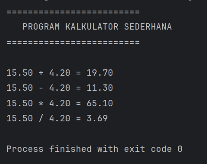
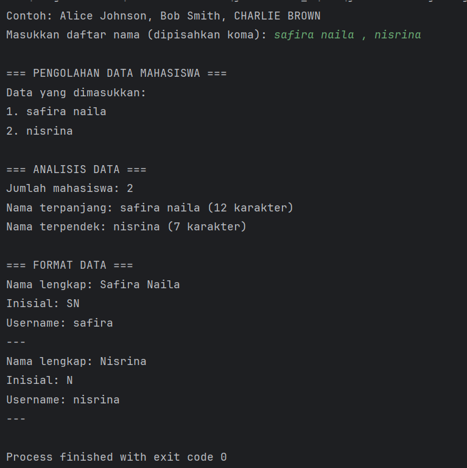

# Laporan Modul 2: Dasar Pemrograman Java
*Mata Kuliah:* Praktikum Pemrograman Berorientasi Objek   
*Nama:* [Safira Naila]  
*NIM:* [2024573010066]  
*Kelas:* [TI 2A]

---

## 1. Abstrak
Praktikum Pemrograman Berorientasi Objek (PBO) Modul 3 ini membahas penerapan konsep dasar struktur data array satu dimensi, array dua dimensi, serta penggunaan method dalam pemrosesan data. Selain itu, praktikum ini juga mengimplementasikan manipulasi string untuk melakukan analisis teks dan pengolahan data berbasis input pengguna. Melalui beberapa studi kasus program, mahasiswa diharapkan mampu memahami cara penyimpanan data dalam array, melakukan operasi pencarian, pengurutan, perhitungan statistik sederhana, serta memproses karakter dalam sebuah string. Hasil dari praktikum ini menunjukkan bahwa penggunaan array dan string dapat membantu mengelola data secara efisien dalam pemrograman Java.

---

## 2. Praktikum
### Praktikum 1 - Array
### 1.1 ArraySatuDimensi
##### Dasar Teori
Array adalah sebuah struktur data yang digunakan untuk menyimpan sekumpulan nilai dengan tipe data yang sama pada lokasi memori yang berurutan. Setiap elemen dalam array diakses menggunakan indeks, yang umumnya dimulai dari angka 0. Penggunaan array membantu pengelolaan data dalam jumlah banyak menjadi lebih efisien, baik dari segi memori maupun pengolahan data.

Array satu dimensi adalah bentuk array yang paling sederhana, di mana data tersusun dalam satu baris dan hanya memerlukan satu indeks untuk mengakses elemen tertentu. Operasi umum pada array meliputi mengisi data, membaca data, melakukan perulangan untuk menampilkan seluruh elemen, serta mengolah data untuk tujuan tertentu seperti mencari nilai maksimum atau mengurutkan.

#### Langkah Praktikum
1. Masuk ke folder src pada project.
2. Buat package baru dengan nama: modul_3
3. Di dalam package tersebut, buat file Java baru dengan nama: ArraySatuDimensi.java
4. Tuliskan kode program berikut:
```declarative
public class ArraySatuDimensi {
   public static void main(String[] args) {
   // Langkah 1: Deklarasi dan inisialisasi array
   int[] nilai = {85, 90, 78, 92, 88};
   String[] nama = {"Alice", "Bob", "Charlie", "Diana", "Eva"};

        // Langkah 2: Menampilkan panjang array
        System.out.println("Jumlah siswa: " + nilai.length);

        // Langkah 3: Mengakses elemen array
        System.out.println("Nama siswa pertama: " + nama[0]);

        // Langkah 4: Menampilkan semua data menggunakan loop
        System.out.println("\nData semua siswa:");
        for (int i = 0; i < nama.length; i++) {
            System.out.println((i + 1) + ". " + nama[i] + " - Nilai: " + nilai[i]);
        }
   }
   }
```

5. Jalankan program untuk melihat hasil outputnya.
6.Tugas:
   Buat array untuk menyimpan nilai ujian 10 siswa,
   kemudian, hitung dan tampilkan rata-rata nilai,
   kemudian, cari dan tampilkan nilai tertinggi dan terendah.
```declarative
package modul_3.latihan;

public class latihan1 {

        public static void main(String[] args) {
            // Langkah 1: Deklarasi dan inisialisasi array
            int[] nilai = {85, 90, 78, 92, 88};
            String[] nama = {"Alice", "Bob", "Charlie", "Diana", "Eva"};

            // Langkah 2: Menampilkan panjang array
            System.out.println("Jumlah siswa: " + nilai.length);

            // Langkah 3: Mengakses elemen array
            System.out.println("Nama siswa pertama: " + nama[0]);

            // Langkah 4: Menampilkan semua data menggunakan loop
            System.out.println("\nData semua siswa:");
            for (int i = 0; i < nama.length; i++) {
                System.out.println((i + 1) + ". " + nama[i] + " - Nilai: " + nilai[i]);
            }

            // Tambahan: Menghitung rata-rata, nilai tertinggi & terendah
            int total = 0;
            int max = nilai[0];
            int min = nilai[0];

            for (int i = 0; i < nilai.length; i++) {
                total += nilai[i];

                if (nilai[i] > max) {
                    max = nilai[i];
                }

                if (nilai[i] < min) {
                    min = nilai[i];
                }
            }

            double rataRata = (double) total / nilai.length;

            // Tampilkan hasil tambahan
            System.out.println("\nRata-rata nilai: " + rataRata);
            System.out.println("Nilai tertinggi: " + max);
            System.out.println("Nilai terendah: " + min);
        }
    }


```

#### Screenshoot Hasil


### 1.2 Array Dua Dimensi
#### Dasar Teori
Array dua dimensi merupakan perluasan dari array satu dimensi yang digunakan untuk menyimpan data dalam bentuk baris dan kolom seperti sebuah tabel atau matriks. Pada Java, array dua dimensi direpresentasikan sebagai “array dari array”, sehingga setiap baris berisi elemen array lain yang mewakili kolom. Deklarasi array dua dimensi ditulis menggunakan dua pasang tanda kurung siku seperti tipeData[][] namaArray. Misalnya int[][] nilai = new int[3][4]; artinya array memiliki 3 baris dan 4 kolom.

Struktur ini umum digunakan ketika data bersifat tabular, contohnya nilai siswa, data inventaris, atau matriks matematika. Untuk mengakses elemen array digunakan indeks baris dan kolom, misalnya nilai[i][j]. Karena elemen dalam array dua dimensi ditata secara baris dan kolom, proses pengolahan datanya sering memanfaatkan perulangan bersarang (nested loop) agar setiap elemen dapat diakses satu per satu secara terstruktur.
#### Langkah Praktikum
1. Membuat file ArrayDuaDimensi.java
2. Tuliskan Kode berikut:
```declarative
public class ArrayDuaDimensi {
    public static void main(String[] args) {
        Scanner input = new Scanner(System.in);
        // Langkah 1: Deklarasi array 2D untuk nilai siswa (3 siswa, 4 mata pelajaran)
        int[][] nilaiSiswa = new int[3][4];
        String[] namaSiswa = new String[3];
        String[] mataPelajaran = {"Matematika", "Bahasa Indonesia", "IPA", "IPS"};

        // Langkah 2: Input nilai
        System.out.println("=== INPUT NILAI SISWA ===");
        for (int i = 0; i < 3; i++) {
            System.out.print("Nama siswa ke-" + (i + 1) + ": ");
            namaSiswa[i] = input.next();
            for (int j = 0; j < 4; j++) {
                System.out.print(mataPelajaran[j] + ": ");
                nilaiSiswa[i][j] = input.nextInt();
            }
            System.out.println();
        }

        // Langkah 3: Menampilkan data dalam bentuk tabel
        System.out.println("=== TABEL NILAI SISWA ===");
        System.out.printf("%-15s", "Nama");
        for (int i = 0; i < 4; i++) {
            // Mengambil 7 karakter pertama untuk header kolom
            System.out.printf("%-15s", mataPelajaran[i].substring(0, Math.min(7, mataPelajaran[i].length())));
        }
        System.out.printf("%-15s\n", "Rata-rata");

        for (int i = 0; i < 3; i++) {
            System.out.printf("%-15s", namaSiswa[i]);
            int total = 0;
            for (int j = 0; j < 4; j++) {
                System.out.printf("%-15d", nilaiSiswa[i][j]);
                total += nilaiSiswa[i][j];
            }
            double ratarata = total / 4.0;
            System.out.printf("%-15.2f\n", ratarata);
        }
    }
}
```
3. Jalankan program untuk melihat hasil outputnya.
4.tugas:
   Dari kode praktikum diatas.
- Tambahkan fitur untuk menampilkan mata pelajaran dengan nilai tertinggi untuk setiap siswa
- Hitung rata-rata nilai untuk setiap mata pelajaran
```declarative
package modul_3.latihan;
import java.util.Scanner;
public class latihan2 {

        public static void main(String[] args) {
            Scanner input = new Scanner(System.in);
            // Langkah 1: Deklarasi array 2D untuk nilai siswa (3 siswa, 4 mata pelajaran)
            int[][] nilaiSiswa = new int[3][4];
            String[] namaSiswa = new String[3];
            String[] mataPelajaran = {"Matematika", "Bahasa Indonesia", "IPA", "IPS"};

            // Langkah 2: Input nilai
            System.out.println("=== INPUT NILAI SISWA ===");
            for (int i = 0; i < 3; i++) {
                System.out.print("Nama siswa ke-" + (i + 1) + ": ");
                namaSiswa[i] = input.next();
                for (int j = 0; j < 4; j++) {
                    System.out.print(mataPelajaran[j] + ": ");
                    nilaiSiswa[i][j] = input.nextInt();
                }
                System.out.println();
            }

            // Langkah 3: Menampilkan data dalam bentuk tabel
            System.out.println("=== TABEL NILAI SISWA ===");
            System.out.printf("%-15s", "Nama");
            for (int i = 0; i < 4; i++) {
                System.out.printf("%-15s", mataPelajaran[i].substring(0, Math.min(7, mataPelajaran[i].length())));
            }
            System.out.printf("%-15s\n", "Rata-rata");

            for (int i = 0; i < 3; i++) {
                System.out.printf("%-15s", namaSiswa[i]);
                int total = 0;
                for (int j = 0; j < 4; j++) {
                    System.out.printf("%-15d", nilaiSiswa[i][j]);
                    total += nilaiSiswa[i][j];
                }
                double ratarata = total / 4.0;
                System.out.printf("%-15.2f\n", ratarata);
            }

            // ✅ Fitur Tambahan
            System.out.println("\n=== NILAI TERTINGGI SETIAP SISWA ===");
            for (int i = 0; i < 3; i++) {
                int max = nilaiSiswa[i][0];
                int indexMax = 0;

                for (int j = 1; j < 4; j++) {
                    if (nilaiSiswa[i][j] > max) {
                        max = nilaiSiswa[i][j];
                        indexMax = j;
                    }
                }
                System.out.println(namaSiswa[i] + " tertinggi pada: " + mataPelajaran[indexMax] + " (" + max + ")");
            }

            System.out.println("\n=== RATA-RATA SETIAP MATA PELAJARAN ===");
            for (int j = 0; j < 4; j++) {
                int totalMapel = 0;
                for (int i = 0; i < 3; i++) {
                    totalMapel += nilaiSiswa[i][j];
                }
                double rataMapel = totalMapel / 3.0;
                System.out.println(mataPelajaran[j] + ": " + String.format("%.2f", rataMapel));
            }
        }
    }


```
#### Screenshoot Hasil


#### Analisa dan Pembahasan
Pada praktikum ini, array satu dimensi dan dua dimensi digunakan untuk menyimpan serta menampilkan data secara terstruktur. Array satu dimensi menyimpan data dalam satu baris, sedangkan array dua dimensi menyimpan data seperti tabel. Hasil praktikum menunjukkan bahwa array memudahkan pengolahan data yang banyak dan sejenis menggunakan indeks dan perulangan. Penggunaan loop mempermudah akses setiap elemen pada array. Dengan demikian, array menjadi dasar penting dalam pengelolaan data di pemrograman.

### Praktikum 2 - Method

### 2.1 Method Array
#### Dasar Teori
Dalam pemrograman Java, method adalah blok kode yang dirancang untuk menjalankan suatu tugas tertentu dan dapat dipanggil berulang kali. Method digunakan agar program lebih terstruktur, mudah dibaca, serta menghindari penulisan kode yang berulang. Method juga dapat menerima parameter sebagai input dan mengembalikan nilai sebagai output, sehingga memudahkan proses pengolahan data.

Ketika digabungkan dengan array, method dapat digunakan untuk melakukan berbagai operasi seperti mencari nilai terbesar, nilai terkecil, menghitung rata-rata, ataupun mengurutkan data. Array sendiri merupakan kumpulan data yang tersimpan dalam satu variabel dengan indeks sebagai pengakses elemennya. Karena array sering berisi banyak data, method memberikan cara yang lebih efisien dan rapi untuk memproses setiap elemen array dibandingkan menulis logika berulang di dalam main.

#### Langkah Praktikum
1. Membuat file ArrayMethod.java
2. Tuliskan Kode berikut:
```declarative
public class ArrayMethod {

    // Method untuk input array
    public static int[] inputArray(int ukuran) {
        Scanner input = new Scanner(System.in);
        int[] array = new int[ukuran];
        System.out.println("Masukkan " + ukuran + " angka:");
        for (int i = 0; i < ukuran; i++) {
            System.out.print("Angka ke-" + (i + 1) + ": ");
            array[i] = input.nextInt();
        }
        return array;
    }

    // Method untuk menampilkan array
    public static void tampilkanArray(int[] array) {
        System.out.print("Array: [");
        for (int i = 0; i < array.length; i++) {
            System.out.print(array[i]);
            if (i < array.length - 1)
                System.out.print(", ");
        }
        System.out.println("]");
    }

    // Method untuk mencari nilai maksimum (Dikonstruksi berdasarkan potongan dan fungsi)
    public static int cariMaksimum(int[] array) {
        int maks = array[0];
        for (int i = 1; i < array.length; i++) {
            if (array[i] > maks) {
                maks = array[i];
            }
        }
        return maks;
    }

    // Method untuk mencari nilai minimum (Dikonstruksi berdasarkan deskripsi praktikum)
    public static int cariMinimum(int[] array) {
        int min = array[0];
        for (int i = 1; i < array.length; i++) {
            if (array[i] < min) {
                min = array[i];
            }
        }
        return min;
    }

    // Method untuk menghitung rata-rata (Dikonstruksi berdasarkan potongan)
    public static double hitungRataRata(int[] array) {
        int total = 0;
        for (int nilai : array) {
            total += nilai;
        }
        return (double) total / array.length;
    }

    // Method untuk mengurutkan array (Bubble Sort)
    public static int[] urutkanArray(int[] array) {
        int[] arrayBaru = array.clone(); // Membuat copy array
        for (int i = 0; i < arrayBaru.length - 1; i++) {
            for (int j = 0; j < arrayBaru.length - 1 - i; j++) {
                if (arrayBaru[j] > arrayBaru[j + 1]) {
                    // Tukar posisi
                    int temp = arrayBaru[j];
                    arrayBaru[j] = arrayBaru[j + 1];
                    arrayBaru[j + 1] = temp;
                }
            }
        }
        return arrayBaru;
    }

    public static void main(String[] args) {
        System.out.println("==== PROGRAM ANALISIS ARRAY ====");
        int[] data = inputArray(5);

        System.out.println("\n==== HASIL ANALISIS ====");
        tampilkanArray(data);
        System.out.println("Nilai Maksimum: " + cariMaksimum(data));
        System.out.println("Nilai Minimum: " + cariMinimum(data));
        System.out.println("Rata-rata: " + hitungRataRata(data));

        int[] dataTerurut = urutkanArray(data);
        System.out.print("Array setelah diurutkan: ");
        tampilkanArray(dataTerurut);
    }
}
```
3. Jalankan program untuk melihat hasil outputnya.
4.tugas:
Dari kode praktikum diatas.
- Tambahkan method untuk operasi pangkat dan akar kuadrat
- Buat method untuk validasi operasi pembagian dengan nol

```declarative
package modul_3.latihan;

public class latihan3 {
        public static void tampilkanHeader() {
            System.out.println("=========================");
            System.out.println("   PROGRAM KALKULATOR SEDERHANA");
            System.out.println("=========================");
            System.out.println();
        }

        public static void tampilkanHasil(String operasi, double a, double b, double hasil) {
            System.out.printf("%.2f %s %.2f = %.2f%n", a, operasi, b, hasil);
        }

        // Method dasar
        public static double tambah(double a, double b) {
            return a + b;
        }

        public static double kurang(double a, double b) {
            return a - b;
        }

        public static double kali(double a, double b) {
            return a * b;
        }

        public static double bagi(double a, double b) {
            if (b == 0) {
                System.out.println("Error: Pembagian dengan nol!");
                return Double.NaN;
            } else {
                return a / b;
            }
        }

        // ✅ Method tambahan: Pangkat
        public static double pangkat(double a, double b) {
            return Math.pow(a, b);
        }

        // ✅ Method tambahan: Akar kuadrat (untuk satu angka)
        public static double akarKuadrat(double a) {
            if (a < 0) {
                System.out.println("Error: Tidak bisa akar bilangan negatif!");
                return Double.NaN;
            }
            return Math.sqrt(a);
        }

        // Validasi angka
        public static boolean validasiAngka(double angka) {
            return !(Double.isNaN(angka) || Double.isInfinite(angka));
        }

        public static void main(String[] args) {
            tampilkanHeader();

            double x = 15.5;
            double y = 4.2;

            if (validasiAngka(x) && validasiAngka(y)) {
                double hasilTambah = tambah(x, y);
                double hasilKurang = kurang(x, y);
                double hasilKali = kali(x, y);
                double hasilBagi = bagi(x, y);
                double hasilPangkat = pangkat(x, y);
                double hasilAkarX = akarKuadrat(x);
                double hasilAkarY = akarKuadrat(y);

                tampilkanHasil("+", x, y, hasilTambah);
                tampilkanHasil("-", x, y, hasilKurang);
                tampilkanHasil("*", x, y, hasilKali);
                tampilkanHasil("/", x, y, hasilBagi);

                System.out.printf("%.2f ^ %.2f = %.2f%n", x, y, hasilPangkat);
                System.out.printf("√%.2f = %.2f%n", x, hasilAkarX);
                System.out.printf("√%.2f = %.2f%n", y, hasilAkarY);
            }
        }
    }


```
#### Screenshoot Hasil

#### Analisa dan Pembahasan
Dari hasil praktikum, semua operasi pada array dapat dilakukan dengan efisien menggunakan perulangan di dalam method. Selain itu, konsep modular programming berhasil diterapkan karena setiap method dapat digunakan kembali tanpa harus menulis ulang logika yang sama. Program menunjukkan bahwa penggunaan method menjadikan pengelolaan dan analisis data dalam array lebih rapi, fleksibel, dan mudah dikembangkan di pemrograman berorientasi objek.

### Praktikum 2 - Method
### 2.2 Method Dasar
#### Dasar Teori
Method merupakan sebuah blok kode yang dirancang untuk melakukan suatu tugas tertentu dan dapat dipanggil berulang kali tanpa harus menuliskan logika yang sama. Dalam Java, penggunaan method membantu membagi program menjadi bagian-bagian kecil (modular) sehingga kode lebih terstruktur, mudah dipahami, serta mempermudah proses pengembangan dan pemeliharaan aplikasi. Method dapat memiliki parameter dan nilai kembalian (return value) untuk mendukung pertukaran informasi antara method dan bagian program lain. Selain itu, Java menyediakan dua jenis method yaitu static method yang dapat dipanggil langsung melalui nama class, serta non-static method yang memerlukan objek untuk mengaksesnya. Konsep ini mendukung paradigma pemrograman berorientasi objek melalui prinsip reusability dan modularitas kode dalam pembangunan perangkat lunak.

#### Langkah Praktikum
1. Membuat file MethodDasar.java
2. Tuliskan Kode berikut:
```declarative
public class MethodDasar {
        public static void tampilkanHeader() {
            System.out.println("=========================");
            System.out.println("   PROGRAM KALKULATOR SEDERHANA");
            System.out.println("=========================");
            System.out.println();
        }
        public static void tampilkanHasil(String operasi, double a, double b, double hasil) {
            System.out.printf("%.2f %s %.2f = %.2f%n", a, operasi, b, hasil);
        }
        public static double tambah(double a, double b) {
            return a + b;
        }
        public static double kurang(double a, double b) {
            return a - b;
        }
        public static double kali(double a, double b) {
            return a * b;
        }
        public static double bagi(double a, double b) {
            if (b == 0) {
                System.out.println("Error: Pembagian dengan nol!");
                return Double.NaN; // NaN = Not a Number
            } else {
                return a / b;
            }
        }

        public static boolean validasiAngka(double angka) {
            return !(Double.isNaN(angka) || Double.isInfinite(angka));
        }

        public static void main(String[] args) {
            tampilkanHeader();

            double x = 15.5;
            double y = 4.2;

            if (validasiAngka(x) && validasiAngka(y)) {
                double hasilTambah = tambah(x, y);
                double hasilKurang = kurang(x, y);
                double hasilKali = kali(x, y);
                double hasilBagi = bagi(x, y);

                tampilkanHasil("+", x, y, hasilTambah);
                tampilkanHasil("-", x, y, hasilKurang);
                tampilkanHasil("*", x, y, hasilKali);
                tampilkanHasil("/", x, y, hasilBagi);
            }
        }
}

```
3. Jalankan program untuk melihat hasil outputnya.
4.Tugas:
Dari kode praktikum diatas.
- Tambahkan method untuk mencari nilai tertentu dalam array
- Buat method untuk menghitung median dari array yang sudah diurutkan

```declarative
package modul_3.latihan;
import java.util.Scanner;
public class latihan4 {
        // Method untuk input array
        public static int[] inputArray(int ukuran) {
            Scanner input = new Scanner(System.in);
            int[] array = new int[ukuran];
            System.out.println("Masukkan " + ukuran + " angka:");
            for (int i = 0; i < ukuran; i++) {
                System.out.print("Angka ke-" + (i + 1) + ": ");
                array[i] = input.nextInt();
            }
            return array;
        }

        // Method untuk menampilkan array
        public static void tampilkanArray(int[] array) {
            System.out.print("Array: [");
            for (int i = 0; i < array.length; i++) {
                System.out.print(array[i]);
                if (i < array.length - 1)
                    System.out.print(", ");
            }
            System.out.println("]");
        }

        // Method untuk mencari nilai maksimum
        public static int cariMaksimum(int[] array) {
            int maks = array[0];
            for (int i = 1; i < array.length; i++) {
                if (array[i] > maks) {
                    maks = array[i];
                }
            }
            return maks;
        }

        // Method untuk mencari nilai minimum
        public static int cariMinimum(int[] array) {
            int min = array[0];
            for (int i = 1; i < array.length; i++) {
                if (array[i] < min) {
                    min = array[i];
                }
            }
            return min;
        }

        // Method untuk menghitung rata-rata
        public static double hitungRataRata(int[] array) {
            int total = 0;
            for (int nilai : array) {
                total += nilai;
            }
            return (double) total / array.length;
        }

        // Method untuk mengurutkan array (Bubble Sort)
        public static int[] urutkanArray(int[] array) {
            int[] arrayBaru = array.clone();
            for (int i = 0; i < arrayBaru.length - 1; i++) {
                for (int j = 0; j < arrayBaru.length - 1 - i; j++) {
                    if (arrayBaru[j] > arrayBaru[j + 1]) {
                        int temp = arrayBaru[j];
                        arrayBaru[j] = arrayBaru[j + 1];
                        arrayBaru[j + 1] = temp;
                    }
                }
            }
            return arrayBaru;
        }

        // ✅ Method tambahan: Cari nilai tertentu dalam array
        public static int cariNilai(int[] array, int target) {
            for (int i = 0; i < array.length; i++) {
                if (array[i] == target) {
                    return i; // index ditemukan
                }
            }
            return -1; // tidak ditemukan
        }

        // ✅ Method tambahan: Hitung median dari array terurut
        public static double hitungMedian(int[] arrayTerurut) {
            int n = arrayTerurut.length;
            if (n % 2 == 1) {
                return arrayTerurut[n / 2]; // tengah langsung
            } else {
                return (arrayTerurut[n / 2 - 1] + arrayTerurut[n / 2]) / 2.0;
            }
        }

        public static void main(String[] args) {
            Scanner input = new Scanner(System.in);
            System.out.println("==== PROGRAM ANALISIS ARRAY ====");
            int[] data = inputArray(5);

            System.out.println("\n==== HASIL ANALISIS ====");
            tampilkanArray(data);
            System.out.println("Nilai Maksimum: " + cariMaksimum(data));
            System.out.println("Nilai Minimum: " + cariMinimum(data));
            System.out.println("Rata-rata: " + hitungRataRata(data));

            int[] dataTerurut = urutkanArray(data);
            System.out.print("Array setelah diurutkan: ");
            tampilkanArray(dataTerurut);

            // ✅ Mencari nilai tertentu
            System.out.print("\nMasukkan angka yang ingin dicari: ");
            int target = input.nextInt();
            int hasilCari = cariNilai(data, target);
            if (hasilCari != -1) {
                System.out.println(target + " ditemukan pada index ke-" + hasilCari);
            } else {
                System.out.println(target + " tidak ditemukan dalam array.");
            }

            // ✅ Menampilkan median
            System.out.println("Median dari array: " + hitungMedian(dataTerurut));
        }
    }


```
#### Screenshoot Hasil


---
### Praktikum 3 - String
### 3.1 String Dasar
#### Dasar Teori
String adalah tipe data yang digunakan untuk menyimpan teks di Java dan ditulis menggunakan tanda kutip dua. String bersifat immutable, artinya saat diubah maka akan terbentuk objek baru di memori. Dalam pemrograman, String banyak digunakan untuk input, output, dan pengolahan data berbasis teks. Java juga menyediakan method seperti length(), charAt(), substring(), toUpperCase(), dan toLowerCase() untuk memudahkan manipulasi teks sehingga lebih efisien dalam proses pengolahan informasi.
#### Langkah Praktikum
1. Membuat file MethodDasar.java
2. Tuliskan Kode berikut:
```declarative
public class StringDasar {

    public static void analisisString(String teks) {
        System.out.println("\n=== ANALISIS STRING ===");
        System.out.println("Teks asli: \"" + teks + "\"");
        System.out.println("Panjang string: " + teks.length());
        System.out.println("Karakter pertama: " + teks.charAt(0));
        System.out.println("Karakter terakhir: " + teks.charAt(teks.length() - 1));
        System.out.println("Uppercase: " + teks.toUpperCase());
        System.out.println("Lowercase: " + teks.toLowerCase());

        // Menghitung jumlah kata
        String[] kata = teks.trim().split("\\s+");
        System.out.println("Jumlah kata: " + kata.length);

        // Menghitung jumlah vokal
        int jumlahVokal = hitungVokal(teks);
        System.out.println("Jumlah vokal: " + jumlahVokal);
        // Method hitungKonsonan() seharusnya dipanggil di sini juga
    }

    public static int hitungVokal(String teks) {
        String vokal = "aeiouAEIOU";
        int count = 0;
        for (int i = 0; i < teks.length(); i++) {
            // Logika disimpulkan dari fungsionalitas
            if (vokal.contains(String.valueOf(teks.charAt(i)))) {
                count++;
            }
        }
        return count;
    }

    // Method untuk membalik string (Dikonstruksi)
    public static String reverseString(String teks) {
        return new StringBuilder(teks).reverse().toString();
    }

    // Method untuk cek palindrome (Dikonstruksi)
    public static boolean isPalindrome(String teks) {
        // Membersihkan string dari spasi/simbol dan mengubah ke lowercase untuk perbandingan
        String cleanTeks = teks.replaceAll("[^a-zA-Z0-9]", "").toLowerCase();
        String reversed = new StringBuilder(cleanTeks).reverse().toString();
        return cleanTeks.equals(reversed);
    }

    public static void main(String[] args) {
        Scanner input = new Scanner(System.in);
        System.out.print("Masukkan sebuah kalimat: ");
        String kalimat = input.nextLine();

        // Analisis dasar
        analisisString(kalimat);

        // String terbalik
        System.out.println("\nString terbalik: \"" + reverseString(kalimat) + "\"");

        // Cek palindrome
        if (isPalindrome(kalimat)) {
            System.out.println("String ini adalah palindrome!");
        } else {
            System.out.println("String ini bukan palindrome.");
        }

        // Pencarian substring
        System.out.print("\nMasukkan kata yang ingin dicari: ");
        String cari = input.nextLine();

        if (kalimat.toLowerCase().contains(cari.toLowerCase())) {
            System.out.println("Kata \"" + cari + "\" ditemukan dalam kalimat.");
            int posisi = kalimat.toLowerCase().indexOf(cari.toLowerCase());
            System.out.println("Posisi pertama: " + posisi);
        } else {
            System.out.println("Kata \"" + cari + "\" tidak ditemukan dalam kalimat.");
        }
    }
}
```
3. Jalankan program untuk melihat hasil outputnya.
4.Tugas:
Dari kode praktikum diatas.
- Tambahkan fitur untuk menghitung jumlah konsonan
- Buat method untuk mengubah string menjadi pascal case (setiap kata diawali huruf besar)

```declarative
package modul_3.latihan;
import java.util.Scanner;
public class latihan5 { 


        public static void analisisString(String teks) {
            System.out.println("\n=== ANALISIS STRING ===");
            System.out.println("Teks asli: \"" + teks + "\"");
            System.out.println("Panjang string: " + teks.length());
            System.out.println("Karakter pertama: " + teks.charAt(0));
            System.out.println("Karakter terakhir: " + teks.charAt(teks.length() - 1));
            System.out.println("Uppercase: " + teks.toUpperCase());
            System.out.println("Lowercase: " + teks.toLowerCase());

            // Menghitung jumlah kata
            String[] kata = teks.trim().split("\\s+");
            System.out.println("Jumlah kata: " + kata.length);

            // Menghitung jumlah vokal
            int jumlahVokal = hitungVokal(teks);
            System.out.println("Jumlah vokal: " + jumlahVokal);

            // ✅ Menghitung jumlah konsonan
            int jumlahKonsonan = hitungKonsonan(teks);
            System.out.println("Jumlah konsonan: " + jumlahKonsonan);
        }

        public static int hitungVokal(String teks) {
            String vokal = "aeiouAEIOU";
            int count = 0;
            for (int i = 0; i < teks.length(); i++) {
                if (vokal.contains(String.valueOf(teks.charAt(i)))) {
                    count++;
                }
            }
            return count;
        }

        // ✅ Method hitung konsonan
        public static int hitungKonsonan(String teks) {
            int count = 0;
            teks = teks.toLowerCase();
            for (int i = 0; i < teks.length(); i++) {
                char c = teks.charAt(i);
                if (Character.isLetter(c) && "aeiou".indexOf(c) == -1) {
                    count++;
                }
            }
            return count;
        }

        // Method untuk membalik string
        public static String reverseString(String teks) {
            return new StringBuilder(teks).reverse().toString();
        }

        // Method untuk cek palindrome
        public static boolean isPalindrome(String teks) {
            String cleanTeks = teks.replaceAll("[^a-zA-Z0-9]", "").toLowerCase();
            String reversed = new StringBuilder(cleanTeks).reverse().toString();
            return cleanTeks.equals(reversed);
        }

        // ✅ Method mengubah string menjadi Pascal Case
        public static String kePascalCase(String teks) {
            String[] kata = teks.split("\\s+");
            StringBuilder hasil = new StringBuilder();
            for (String k : kata) {
                if (k.length() > 0) {
                    hasil.append(Character.toUpperCase(k.charAt(0)));
                    if (k.length() > 1) {
                        hasil.append(k.substring(1).toLowerCase());
                    }
                    hasil.append(" ");
                }
            }
            return hasil.toString().trim();
        }

        public static void main(String[] args) {
            Scanner input = new Scanner(System.in);
            System.out.print("Masukkan sebuah kalimat: ");
            String kalimat = input.nextLine();

            // Analisis dasar
            analisisString(kalimat);

            // String terbalik
            System.out.println("\nString terbalik: \"" + reverseString(kalimat) + "\"");

            // Cek palindrome
            if (isPalindrome(kalimat)) {
                System.out.println("String ini adalah palindrome!");
            } else {
                System.out.println("String ini bukan palindrome.");
            }

            // Pencarian substring
            System.out.print("\nMasukkan kata yang ingin dicari: ");
            String cari = input.nextLine();

            if (kalimat.toLowerCase().contains(cari.toLowerCase())) {
                System.out.println("Kata \"" + cari + "\" ditemukan dalam kalimat.");
                int posisi = kalimat.toLowerCase().indexOf(cari.toLowerCase());
                System.out.println("Posisi pertama: " + posisi);
            } else {
                System.out.println("Kata \"" + cari + "\" tidak ditemukan dalam kalimat.");
            }

            // ✅ Menampilkan versi Pascal Case
            String pascalCase = kePascalCase(kalimat);
            System.out.println("\nPascal Case: " + pascalCase);
        }
    }


```
#### Screenshoot Hasil


### 3.2 Text Processing
#### Dasar Teori
Text Processing atau pemrosesan teks adalah suatu teknik dalam pemrograman yang digunakan untuk membaca, menganalisis, memanipulasi, dan mengolah data berbentuk teks. Dalam dunia komputer, sebagian besar informasi disimpan dalam bentuk teks — seperti dokumen, pesan, data log, atau masukan pengguna — sehingga kemampuan untuk mengolah teks menjadi hal yang sangat penting.

Dalam pemrograman, pemrosesan teks biasanya melibatkan operasi seperti pencarian kata atau karakter, penggantian teks, penghitungan jumlah kata, pemisahan kalimat, penghapusan tanda baca, hingga pemeriksaan pola tertentu menggunakan regular expression (regex). Dengan text processing, program dapat mengambil informasi penting dari teks mentah dan mengubahnya menjadi data yang lebih terstruktur dan mudah dianalisis.

#### Langkah Praktikum
1. Membuat file MethodDasar.java
2. Tuliskan Kode berikut:
```declarative
public class TextProcessing {
    public static void prosesDataMahasiswa(String data) {
        System.out.println("\n=== PENGOLAHAN DATA MAHASISWA ===");
        // Memisahkan data berdasarkan koma
        String[] dataMahasiswa = data.split(",");

        System.out.println("Data yang dimasukkan:");
        for (int i = 0; i < dataMahasiswa.length; i++) {
            dataMahasiswa[i] = dataMahasiswa[i].trim(); // Menghilangkan spasi
            System.out.println((i + 1) + ". " + dataMahasiswa[i]);
        }

        // Analisis data
        System.out.println("\n=== ANALISIS DATA ===");
        System.out.println("Jumlah mahasiswa: " + dataMahasiswa.length);

        // Mencari nama terpanjang dan terpendek
        String namaTerpanjang = dataMahasiswa[0];
        String namaTerpendek = dataMahasiswa[0];

        for (String nama : dataMahasiswa) {
            if (nama.length() > namaTerpanjang.length()) {
                namaTerpanjang = nama;
            }
            if (nama.length() < namaTerpendek.length()) {
                namaTerpendek = nama;
            }
        }
        // Output Analisis (Dikonstruksi berdasarkan hasil screenshot)
        System.out.println("Nama terpanjang: " + namaTerpanjang + " (" + namaTerpanjang.length() + " karakter)");
        System.out.println("Nama terpendek: " + namaTerpendek + " (" + namaTerpendek.length() + " karakter)");

        System.out.println("\n=== FORMAT DATA ===");
        for (String nama : dataMahasiswa) {
            String namaFormatted = formatTitleCase(nama);
            String inisial = buatInisial(namaFormatted);

            System.out.println("Nama lengkap: " + namaFormatted);
            System.out.println("Inisial: " + inisial);
            System.out.println("Username: " + buatUsername(namaFormatted));
            System.out.println("---");
        }
    }

    public static String formatTitleCase(String teks) {
        String[] kata = teks.toLowerCase().split(" ");
        StringBuilder result = new StringBuilder();

        for (String k : kata) {
            if (k.length() > 0){
                result.append(Character.toUpperCase(k.charAt(0)))
                        .append(k.substring(1))
                        .append(" ");
            }
        }
        return result.toString().trim();
    }

    public static String buatInisial(String nama) {
        String[] kata = nama.split(" ");
        StringBuilder inisial = new StringBuilder();

        for (String k : kata) {
            if (k.length() > 0) {
                inisial.append(Character.toUpperCase(k.charAt(0)));
            }
        }
        return inisial.toString();
    }

    // Method untuk membuat username (Dikonstruksi berdasarkan hasil screenshot)
    public static String buatUsername(String nama) {
        // Mengambil kata pertama dan mengubahnya menjadi huruf kecil
        String[] kata = nama.split(" ");
        return kata[0].toLowerCase();
    }

    public static void main(String[] args) {
        Scanner input = new Scanner(System.in);
        System.out.println("Contoh: Alice Johnson, Bob Smith, CHARLIE BROWN");
        System.out.print("Masukkan daftar nama (dipisahkan koma): ");
        String dataInput = input.nextLine();
        prosesDataMahasiswa(dataInput);
    }
}
```
3. Jalankan program untuk melihat hasil outputnya.

4. Tugas:
   Dari kode praktikum diatas.
- Tambahkan fitur untuk menghasilkan email address berdasarkan nama
- Buat method untuk memvalidasi format nama (tidak boleh mengandung angka atau karakter khusus)

```declarative
package modul_3.latihan;
import java.util.Scanner;
public class latihan6 {

public static void prosesDataMahasiswa(String data) {
System.out.println("\n=== PENGOLAHAN DATA MAHASISWA ===");
// Memisahkan data berdasarkan koma
String[] dataMahasiswa = data.split(",");

System.out.println("Data yang dimasukkan:");
for (int i = 0; i < dataMahasiswa.length; i++) {
dataMahasiswa[i] = dataMahasiswa[i].trim(); // Menghilangkan spasi
System.out.println((i + 1) + ". " + dataMahasiswa[i]);
}

// Analisis data
System.out.println("\n=== ANALISIS DATA ===");
System.out.println("Jumlah mahasiswa: " + dataMahasiswa.length);

// Mencari nama terpanjang dan terpendek
String namaTerpanjang = dataMahasiswa[0];
String namaTerpendek = dataMahasiswa[0];

for (String nama : dataMahasiswa) {
if (nama.length() > namaTerpanjang.length()) {
namaTerpanjang = nama;
}
if (nama.length() < namaTerpendek.length()) {
namaTerpendek = nama;
}
}

System.out.println("Nama terpanjang: " + namaTerpanjang + " (" + namaTerpanjang.length() + " karakter)");
System.out.println("Nama terpendek: " + namaTerpendek + " (" + namaTerpendek.length() + " karakter)");

System.out.println("\n=== FORMAT DATA ===");
for (String nama : dataMahasiswa) {
// ✅ Validasi nama
if (!validasiNama(nama)) {
System.out.println("Nama \"" + nama + "\" tidak valid (mengandung angka atau karakter khusus).");
System.out.println("---");
continue;
}

String namaFormatted = formatTitleCase(nama);
String inisial = buatInisial(namaFormatted);
String username = buatUsername(namaFormatted);
String email = buatEmail(namaFormatted);

System.out.println("Nama lengkap: " + namaFormatted);
System.out.println("Inisial: " + inisial);
System.out.println("Username: " + username);
System.out.println("Email: " + email);
System.out.println("---");
}
}

public static String formatTitleCase(String teks) {
String[] kata = teks.toLowerCase().split(" ");
StringBuilder result = new StringBuilder();

for (String k : kata) {
if (k.length() > 0){
result.append(Character.toUpperCase(k.charAt(0)))
.append(k.substring(1))
.append(" ");
}
}
return result.toString().trim();
}

public static String buatInisial(String nama) {
String[] kata = nama.split(" ");
StringBuilder inisial = new StringBuilder();

for (String k : kata) {
if (k.length() > 0) {
inisial.append(Character.toUpperCase(k.charAt(0)));
}
}
return inisial.toString();
}

public static String buatUsername(String nama) {
String[] kata = nama.split(" ");
return kata[0].toLowerCase();
}

// ✅ Method tambahan: Membuat email berdasarkan nama
public static String buatEmail(String nama) {
String[] kata = nama.split(" ");
if (kata.length < 2) {
// Jika hanya satu kata, gunakan kata itu + angka random
return kata[0].toLowerCase() + "@example.com";
} else {
return (kata[0].toLowerCase() + "." + kata[kata.length - 1].toLowerCase() + "@example.com");
}
}

// ✅ Method tambahan: Validasi nama
public static boolean validasiNama(String nama) {
// Hanya boleh huruf dan spasi
return nama.matches("[a-zA-Z\\s]+");
}

public static void main(String[] args) {
Scanner input = new Scanner(System.in);
System.out.println("Contoh: Alice Johnson, Bob Smith, CHARLIE BROWN");
System.out.print("Masukkan daftar nama (dipisahkan koma): ");
String dataInput = input.nextLine();
prosesDataMahasiswa(dataInput);
}
}


```
#### Screenshoot Hasil



#### Analisa dan Pembahasan
Pada program String Dasar dan Text Processing, input teks diolah menggunakan berbagai method String seperti length(), charAt(), toUpperCase(), dan split(). Program dapat menghitung panjang teks, jumlah kata, memeriksa palindrome, serta memisahkan daftar nama untuk dianalisis. Selain itu, teks juga diformat menjadi title case, dibuat inisial, dan username. Dari hasil tersebut, terlihat bahwa manipulasi string di Java sangat berguna untuk pengolahan data berbasis teks.
## 3. Kesimpulan
Dari praktikum Array, Method, dan String pada Java, dapat disimpulkan bahwa ketiganya merupakan dasar penting dalam pemrograman. Array digunakan untuk menyimpan banyak data secara terstruktur dan mudah diakses. Method membantu membuat program lebih rapi, terorganisir, serta mudah digunakan kembali. String memungkinkan pengolahan data teks dengan berbagai fungsi bawaan Java.

Pemahaman terhadap ketiga konsep ini mendukung kemampuan logika dalam menyusun solusi program. Selain itu, mahasiswa juga menjadi lebih terampil dalam mengelola data dan membangun kode yang efisien. Materi ini menjadi pondasi yang sangat berguna untuk mempelajari konsep OOP dan pengembangan aplikasi Java selanjutnya.

---

## 4.Referensi

Petani Kode.
Belajar Java: Mengenal Array di Java.
Diakses dari: https://www.petanikode.com/java-array/

W3Schools.
Java Methods and Strings Tutorial.
Diakses dari: https://www.w3schools.com/java/

Modul Praktikum Java – HackMD (mohdrzu).
Modul Praktikum 3: Array, Method, dan String.
Diakses dari: https://hackmd.io/@mohdrzu/BJBWepc3xg
---